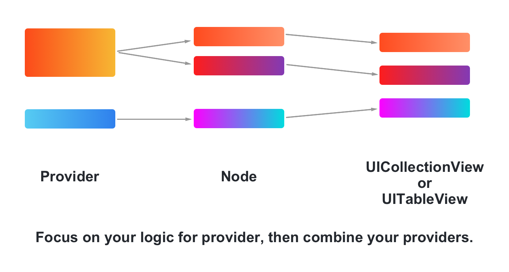

[](https://travis-ci.org/DianQK/Flix)
[](https://cocoapods.org/pods/Flix)
[](https://github.com/Carthage/Carthage)

Flix 为 iOS 动态表单提供了足够优雅的解决方案。你可以用它构建任何(类)表单页面。

## 预览


## 原理



每个 Provider 会生成若干个 Node，Flix 按照组合的 Provider 顺序依次生成全部的 Cell。

## 安装

```ruby
pod 'Flix', '~> 0.7.0-rc.0'
```

## 开始使用

### 构建一个登录页面

我们可以非常轻松地使用 Flix 构建一个登录页面：

只需要四个步骤：

- 创建一个登录框
- 创建一个输入密码框
- 创建一个登录按钮
- 组合三个视图组件的布局

创建一个登录框：

```swift
let usernameTextField = UITextField()
usernameTextField.placeholder = "用户名"
usernameTextField.keyboardType = .asciiCapable

let usernameProvider = UniqueCustomTableViewProvider()
usernameProvider.contentView.addSubview(usernameTextField)
// 添加你的布局方案
// usernameTextField.translatesAutoresizingMaskIntoConstraints = false
// usernameTextField.leadingAnchor.constraint(equalTo: usernameProvider.contentView.leadingAnchor, constant: 15).isActive = true
// usernameTextField.topAnchor.constraint(equalTo: usernameProvider.contentView.topAnchor).isActive = true
// usernameTextField.trailingAnchor.constraint(equalTo: usernameProvider.contentView.trailingAnchor, constant: -15).isActive = true
// usernameTextField.bottomAnchor.constraint(equalTo: usernameProvider.contentView.bottomAnchor).isActive = true
```

创建一个密码输入框：

```swift
let passwordTextField = UITextField()
passwordTextField.placeholder = "密码"
passwordTextField.isSecureTextEntry = true
let passwordProvider = UniqueCustomTableViewProvider()
passwordProvider.contentView.addSubview(passwordTextField)
// 添加你的布局方案
// passwordTextField.translatesAutoresizingMaskIntoConstraints = false
// passwordTextField.leadingAnchor.constraint(equalTo: passwordProvider.contentView.leadingAnchor, constant: 15).isActive = true
// passwordTextField.topAnchor.constraint(equalTo: passwordProvider.contentView.topAnchor).isActive = true
// passwordTextField.trailingAnchor.constraint(equalTo: passwordProvider.contentView.trailingAnchor, constant: -15).isActive = true
// passwordTextField.bottomAnchor.constraint(equalTo: passwordProvider.contentView.bottomAnchor).isActive = true
```

创建一个登录按钮：

```swift
let loginTextLabel = UILabel()
loginTextLabel.text = "登录"
loginTextLabel.textAlignment = .center
let loginProvider = UniqueCustomTableViewProvider()
loginProvider.contentView.addSubview(loginTextLabel)
// 添加你的布局方案
// loginTextLabel.translatesAutoresizingMaskIntoConstraints = false
// loginTextLabel.leadingAnchor.constraint(equalTo: loginProvider.contentView.leadingAnchor).isActive = true
// loginTextLabel.topAnchor.constraint(equalTo: loginProvider.contentView.topAnchor).isActive = true
// loginTextLabel.trailingAnchor.constraint(equalTo: loginProvider.contentView.trailingAnchor).isActive = true
// loginTextLabel.bottomAnchor.constraint(equalTo: loginProvider.contentView.bottomAnchor).isActive = true
// 添加你的点击事件
// loginProvider.tap...
```

最后将以上三个 Provider 按顺序组装起来：

```swift
self.tableView.flix.build([usernameProvider, passwordProvider, loginProvider])
```

一个使用 `UITableView` 的登录页面就完成了。

## 优势

- [x] 支持 `UICollectionView` / `UITableView`
- [x] 可以免去重用带来的烦恼
- [x] 列表项支持重用
- [x] 支持内嵌表单
- [x] 支持移动、删除、添加

Flix 专注于构建 `UICollectionView` / `UITableView` 的 Cell ，不关心视图的布局、业务的逻辑。于是你可以很轻松地使用 Flix 构建定制的页面。

## 使用

因为 `CollectionViewProvider` 和 `TableViewProvider` 几乎一样，我们全部以 `UITableView` 的构建解释每一个 Provider 的使用方法。

> 你也可以在示例中找到全部的 `CollectionViewProvider` 使用示例。

注意：所有的 `AnimatableProvider` 生成的 Value (Node) 都需要服从协议 `StringIdentifiableType` 和 `Equatable`。
`StringIdentifiableType` 用于描述一个 Value（Node）是否为同一个 Value。
`Equatable` 用于描述同一个 Value 是否有更新。

### `UniqueCustomTableViewProvider` 使用

当构建一个诸如登录页面、个人页或设置页时，我们希望某些 Cell 不需要被重用（有时这个 Cell 在整个 `UITableView` 中仅存在一个），那么使用 `UniqueCustomTableViewProvider` 可以完全忽略重用的问题（通过在 `UITableView` 中注册一个全局唯一的 Cell）。

创建一个 `UniqueCustomTableViewProvider` 需要提供一个全局唯一的 `identity` 确保在 Provider 管理中不会错乱。
**事实上，每一个 Provider 的 `identity` 都需要在一个 `UITableView` 中唯一。**

`UniqueCustomTableViewProvider` 中的 `contentView` 类似于 `UITableViewCell` 中的 `contentView` ，你可以直接添加对应的视图到 `contentView` 中。

`itemHeight` 用于返回 Cell 的高度，`tap` 是该 `Provider` / `Cell` 的点击事件。

如果你想完全定制一个唯一 Cell ，你也可以通过服从协议 `UniqueAnimatableTableViewProvider` 完成。

## `AnimatableTableViewMultiNodeProvider` 和 `AnimatableTableViewProvider`

两个 `Provider` 都支持局部更新 `UITableView` （即更新时不调用 `reloadData`）。

在 `genteralValues() -> Observable<[Value]>` 方法中实现你的 Provider 生成 Node 的方法。

## `AnimatablePartionSectionTableViewProvider` 和 `AnimatableTableViewSectionProvider`

`AnimatablePartionSectionTableViewProvider` 和 `AnimatableTableViewSectionProvider` 提供了构建 Section 的支持。
`AnimatablePartionSectionTableViewProvider` 用于构建 Section 的 Header 和 Footer，`AnimatableTableViewSectionProvider` 用于组合 `AnimatablePartionSectionTableViewProvider` 和 `AnimatableProvider`。

`AnimatablePartionSectionTableViewProvider` 的使用类似于 `AnimatableTableViewProvider`，在使用时，你需要注意这个 `Provider` 是 Header 还是 Footer。

比如：

```swift
let footerProvider = UniqueCustomTableViewSectionProvider(tableElementKindSection: .header)
let sectionProvider = AnimatableTableViewSectionProvider(
    identity: "sectionProvider",
    providers: [],
    footerProvider: footerProvider
)
```

就是一个错误的用法。

## 构建

通过调用 `tableView.flix.build(_:)` 或 `tableView.flix.animatable.build(_:)` 构建全部的 Cell。`tableView.flix.animatable.build(_:)` 中传入的 Provider 必须都是 `AnimatableProvider` 。

当你需要调换 provider 的是顺序时，可以直接再次调用 `build` 方法，

其余详细使用方法，可以参考 Example 中的一些示例。
